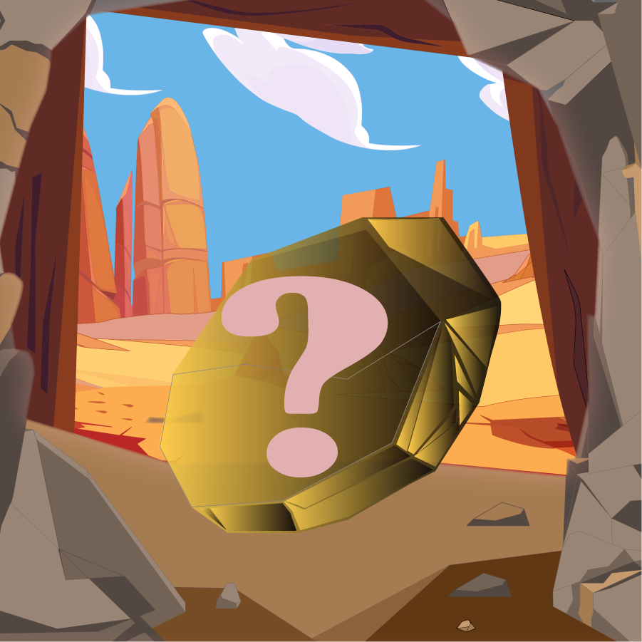

# 🥇 G Minions

<figure><figcaption></figcaption></figure>

\
Introducing the G Minions Collection: Genesis NFTs in the Jax World Ecosystem

Total Supply: 5000 Distribution: Private Sale: 1500 Public Sale: 4300

The G Minions Collection represents a series of 5000 uniquely generated custom NFTs within the Jax World ecosystem. These NFTs are crafted from freshly minted "Gold" sourced from mines spread across Jax World, formerly owned by the Miners community of Jax Ville. Breaking free from the confines of the treasury boxes, these NFTs have embarked on an ambitious venture to construct a vast decentralized gaming platform. This platform will encompass a myriad of features, games, community events, and an extensive range of functionalities and events.

Below, we present the 10 classes of the G Minions Collection, listed in order of rarity and supply:

1. Mayor - Legendary - 20
2. Captain - Legendary - 20
3. Godfather - Legendary - 20
4. Sheriff - Epic - 140
5. Pirate - Epic - 140
6. Consigliere - Epic - 140
7. Citizen - Rare - 500
8. Sailor - Rare - 500
9. Gangster - Rare - 500
10. Miner - Common - 3020

Holders of the G Minion NFTs collection will enjoy exclusive access to community events and secure whitelist spots for future NFT offerings. Additionally, each G Minion NFT possesses a boosting ability based on its rarity, enhancing all activities related to staking, mining, and the Saloon. Comprehensive information regarding staking and mining functionalities, G Minion boosting, community events, and upcoming NFT collections will be disclosed soon.

Regenerate response\
\
Join our [discord server](https://discord.com/invite/dPNE6fK4S4) and stay tuned for the latest updates related to Jax World.

