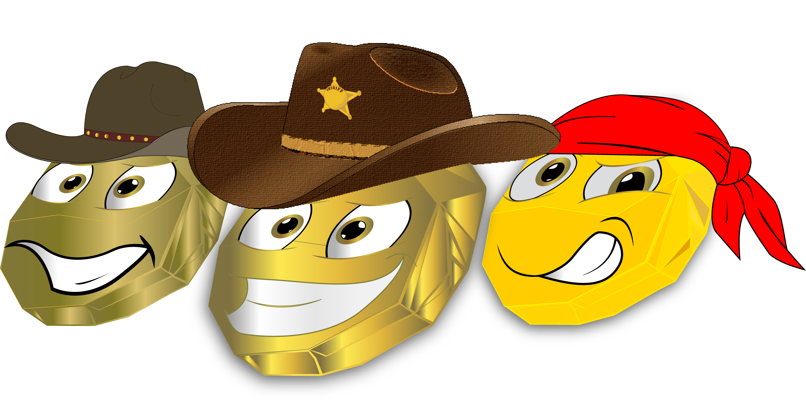

# 🥇 G Minions

<figure><figcaption></figcaption></figure>

_**Total Supply:**_ <mark style="color:blue;">**5000**</mark>

**Distribution:**\
_**Private Sale**_** : **<mark style="color:blue;">**1500**</mark>\
_**Public Sale:**_ <mark style="color:blue;">**4300**</mark>

**G Minions** are the **Genesis NFT collection** in JAX Miners ecosystem.\
The collection contains **5000 custom generated unique NFTs**. These  pieces of freshly minted  'Gold' from mines around JAX World previously owned by the Miners community of JAX Ville escaped the treasury boxes and decided to built a huge decentralized gaming platform with many features, games, community events and many more functionalities and events.\

Bellow are the **10** classes of G Minions Collection ordered by rarity and supply:\
**1.** Mayor - **Legendary - **<mark style="color:blue;">**20**</mark>.\
**2.** Captain - **Legendary - **<mark style="color:blue;">**20**</mark>.\
**3**. Godfather - **Legendary - **<mark style="color:blue;">**20**</mark>.\
**4.** Sheriff - **Epic - **<mark style="color:blue;">**140**</mark>.\
**5.** Pirate - **Epic - **<mark style="color:blue;">**140**</mark>.\
**6.** Consigliere- **Epic - **<mark style="color:blue;">**140**</mark>.\
**7.** Citizen - **Rare - **<mark style="color:blue;">**500**</mark>.\
**8.** Sailor - **Rare - **<mark style="color:blue;">**500**</mark> .\
**9.** Gangster - **Rare - **<mark style="color:blue;">**500**</mark>.\
**10.** Miner - **Common - **<mark style="color:blue;">**3020**</mark>.

**Holders of G Minion NFTs collection  will receive exclusive access** to community events, future land selling event and NFT collection - JAX Miners. . Additionally each G Minion NFT has _**boosting ability**_ **based on rarity** for all activities related to staking, mining and mini games section. **Detailed information** about staking and mining functionalities, G minion boosting, community events, future land selling event and next NFT collections is **available here on our DOCS page**. \
\
Stay tuned to this section and our [discord server](https://discord.com/invite/dPNE6fK4S4) for the latest updates and releases of our NFT collections.

